# Lab 01 - EC2 Compromise Investigation

**Live notes (Notion):** [AWS Security Labs Portfolio](https://www.notion.so/AWS-Security-Labs-Portfolio-292570094627807c827ccf2b6991b096) → *1. Incident Response* → *Lab 01 - EC2 Compromise Investigation*

**Official lab:** [AWS Skill Builder — Security Engineer Advanced Learning Plan (includes labs)](https://skillbuilder.aws/learning-plan/NTDPRSFC3F/aws-security-engineer-advanced-learning-plan-includes-labs/VUD51DEB41)

**AWS services:** EC2, GuardDuty, CloudTrail (plus S3, EBS, CloudWatch Logs, Systems Manager, Lambda, EventBridge, IAM as used in the walkthrough)

**Frameworks:** NIST, PCI-DSS

Screenshots below are mirrored from the public Notion page into this repo under [`../../assets/images/lab01-ec2-compromise/`](../../assets/images/lab01-ec2-compromise/).

---

## Overview

In this lab, you act as a member of the incident response team after an alert about a possible **compromised EC2 instance**. You respond using processes and techniques for **investigation**, **analysis**, and **lessons learned**.

As a security engineer at **AnyCompany**, you are alerted to a potential breach on an application server where **multiple failed login attempts** were detected. You must **safely analyze** the instance to determine whether a breach occurred, **address vulnerabilities** that contributed to it, and perform **remediation**.

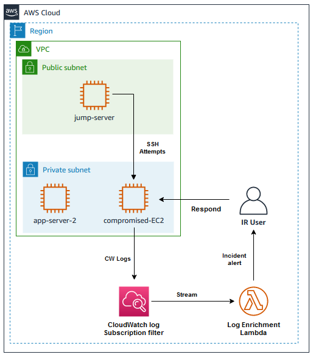

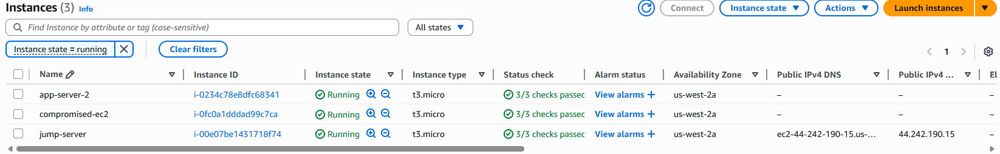

---

## Objectives

By the end of this lab, you should be able to:

- Capture compromised instance **metadata** and **persistent disks**
- Create a **snapshot** of the compromised instance
- **Isolate** the instance and protect against **accidental termination**
- Review **system logs** to validate the suspected breach
- **Update instance settings** to mitigate a vulnerability
- Create **automated incident response** for similar incidents in the future

---

## AWS Services Used

| Area | Services |
| ---- | -------- |
| Compute & storage | **Amazon EC2**, **Amazon EBS** (snapshots), **Amazon S3** (IR / evidence bucket) |
| Detection & audit | **Amazon GuardDuty**, **AWS CloudTrail** |
| Logging | **Amazon CloudWatch Logs** |
| Operations | **AWS Systems Manager** (Run Command, Session Manager) |
| Automation | **AWS Lambda**, **Amazon EventBridge** |
| Access | **IAM** (instance profiles / roles), **security groups** |

---

## Step-by-Step Walkthrough

### Task 1 — Capture compromised disks and metadata

**Task 1.1–1.2: Capture persistent disk / metadata and upload to S3**

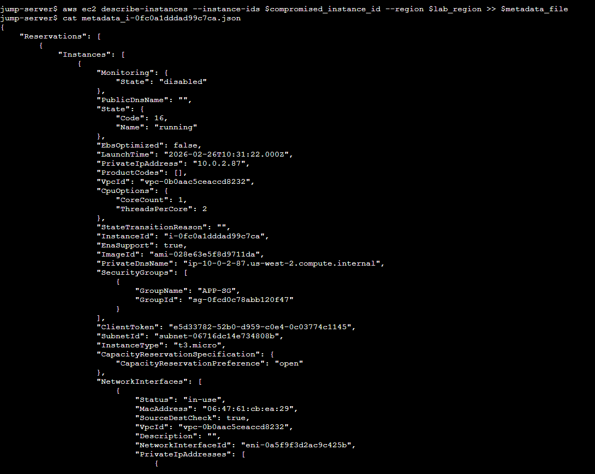

Upload forensic-related data to the **IR S3 bucket**:

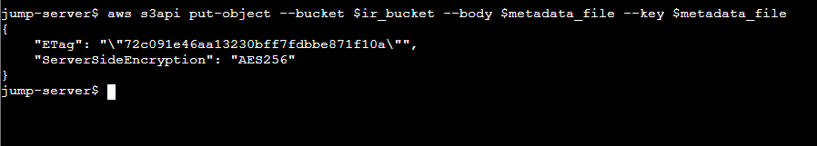

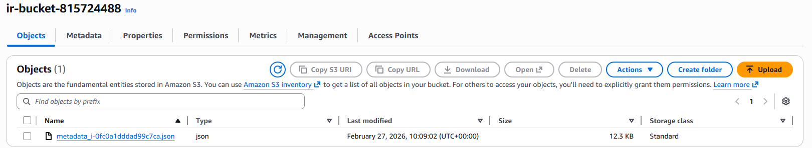

**Task 1.3: Enable termination protection** on the compromised instance.

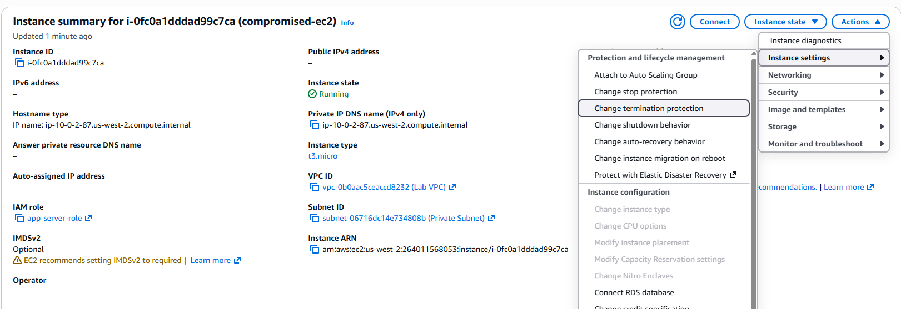

**Task 1.4: Capture instance memory and disks**

EBS **snapshot** of the compromised volume:

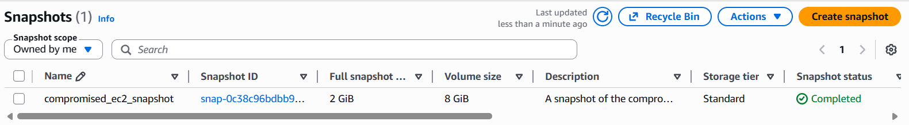

For **memory**, the lab uses **third-party tools** on the instance (e.g., approaches involving **LiME** on Linux). After capture, you can take **another snapshot** that includes the memory dump on disk.

You normally avoid ad-hoc **interactive SSH** on a suspect host because it can **change state** and affect forensics. **AWS Systems Manager Run Command** invokes the **SSM Agent** to run scripts remotely—reducing direct interactive access while still executing capture tooling.

**Task 1.5 (optional):** Deploy a **new instance** from the captured snapshot for isolated analysis.

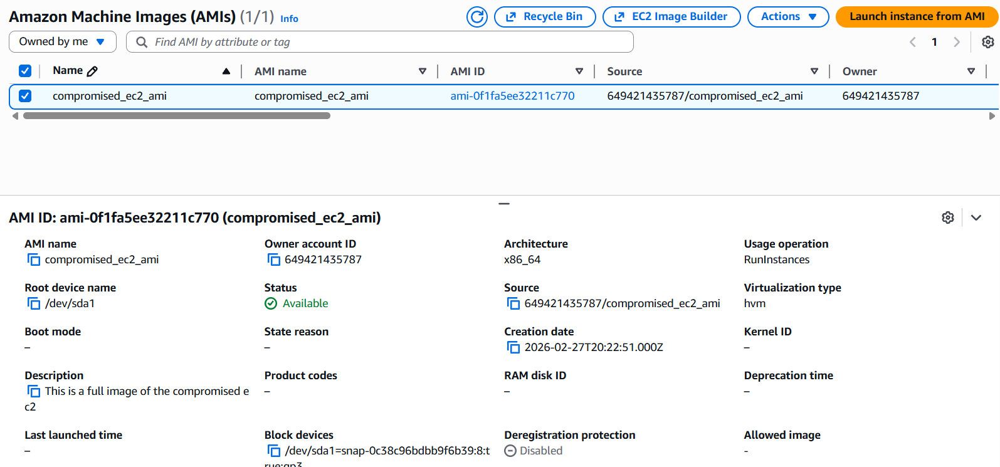

**Task 1.6: Tag, decommission, and isolate**

- Tag the instance (e.g., **`Status=Quarantined`**).

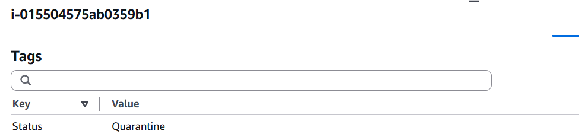

- **Remove** the **IAM instance profile** from the instance.

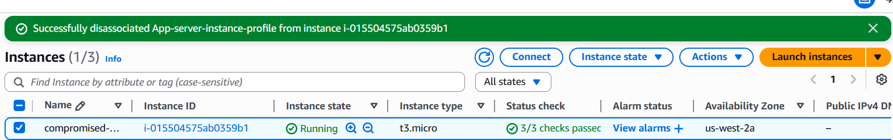

- Move the instance to a **quarantine security group**.

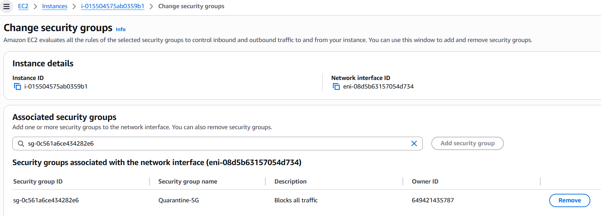

**Task 1 complete:**

- Captured compromised instance metadata  
- Enabled termination protection  
- Captured disks to snapshot (and optional image for analysis)  
- Tagged, decommissioned, and isolated the instance  

---

### Task 2 — Investigate using system logs

Review logs and indicators. Example findings:

| Indicator | Severity |
| --------- | -------- |
| New privileged user | **HIGH** |
| Password authentication enabled | **MEDIUM–HIGH** |
| SSH restarts | **MEDIUM** |
| Internal brute force | **HIGH** |
| CloudWatch agent creation | **Normal** |

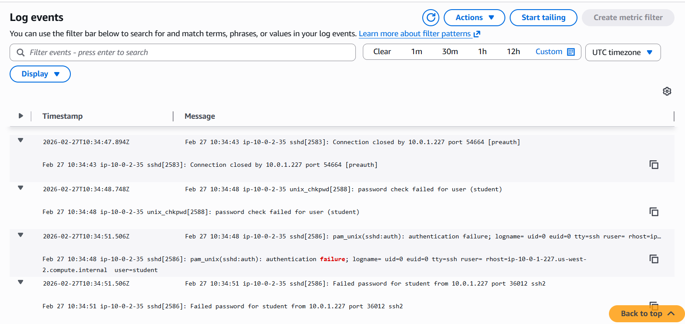

**Recommendation:** Disable and block **SSH** where appropriate, and use **AWS Systems Manager Session Manager** for access—**no inbound SSH**, **IAM-controlled** access, auditable via **CloudTrail**.

---

### Task 3 — Mitigate the vulnerability

**Task 3.1: Add SSM permissions to the instance profile (IAM role)** so the instance can use **Session Manager**.

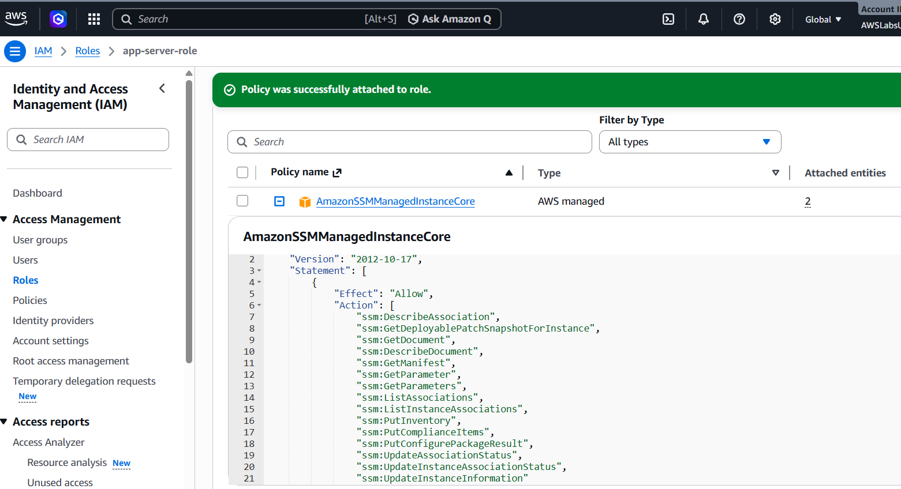

Attach the role to the instance and **reboot** if needed so permissions take effect.

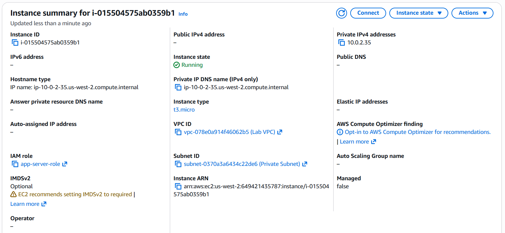

**Task 3.2:** Remove **inbound SSH** from the security group and transition off the **quarantine** security group per lab steps.

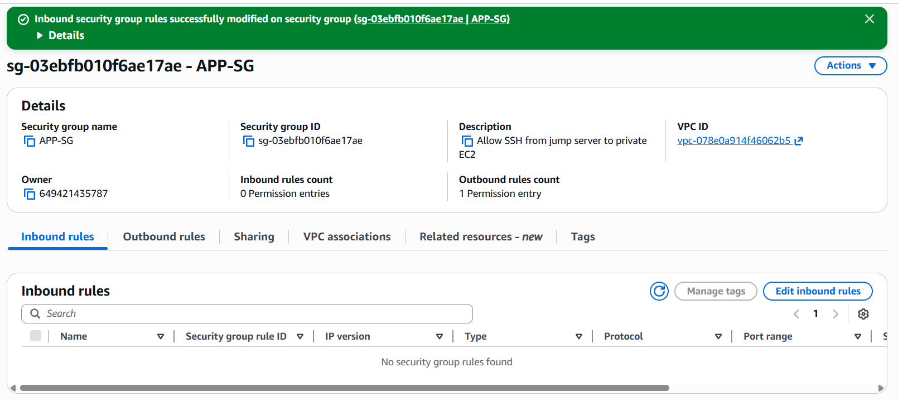

**Task 3.3:** Connect via **Session Manager**, validate remediation, and **remove the quarantine tag** when appropriate.

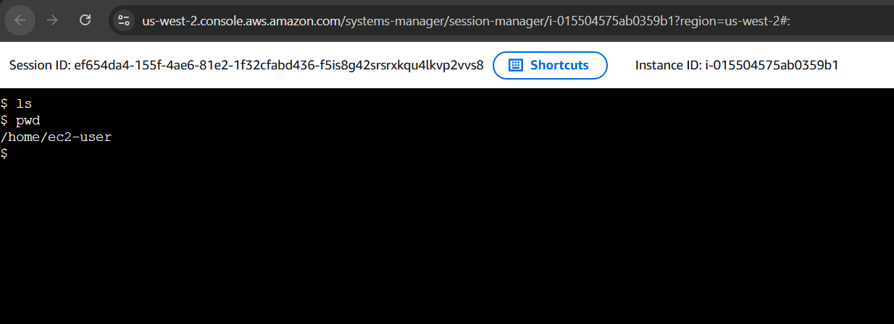

---

### Task 4 — Automated incident response

**Architecture (high level):**

- **Jump server** simulates **SSH authentication failures** against an **app server**.  
- The app server sends **SSH auth failure** logs to **CloudWatch Logs**.  
- A **subscription filter** forwards matches to a **Log Enrichment Lambda**.  
- The Lambda resolves **internal IP → instance ID** and sends an event to **EventBridge**.  
- An **EventBridge rule** invokes an **Automation Lambda** that performs containment steps.

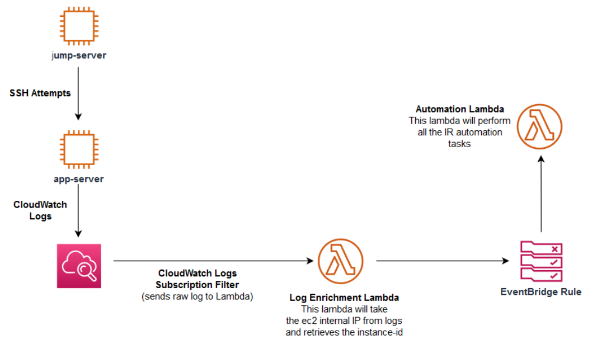

**EventBridge / Lambda (source side):**

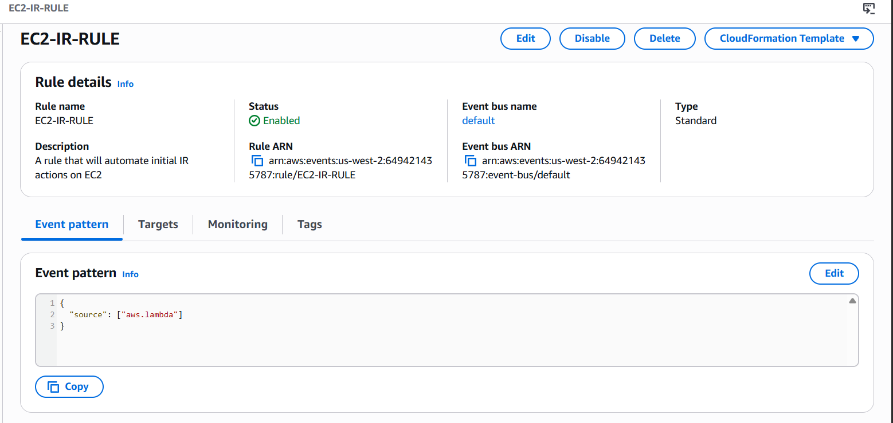

**Automation target:**

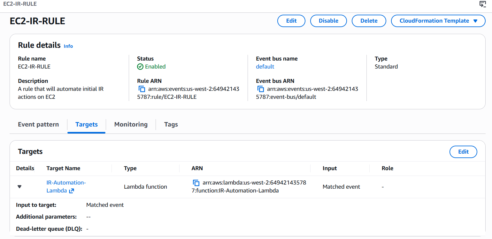

**Task 4.2: Test against another instance (`app-server-2`)**

If automation is correct, the response should:

- Capture metadata and upload to **IR-Bucket**  
- Enable **termination protection**  
- Snapshot the instance volume  
- Apply **`Status: Quarantine`** tag  
- Remove the current **IAM role**  
- Replace **App-server-2-SG** with **Quarantine-SG**

Trigger failed SSH attempts from the **jump server**:

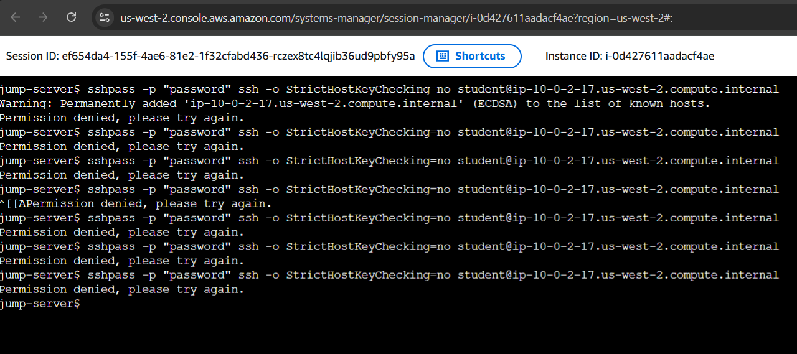

**Result:** Automation runs successfully.

**Metadata in S3:**

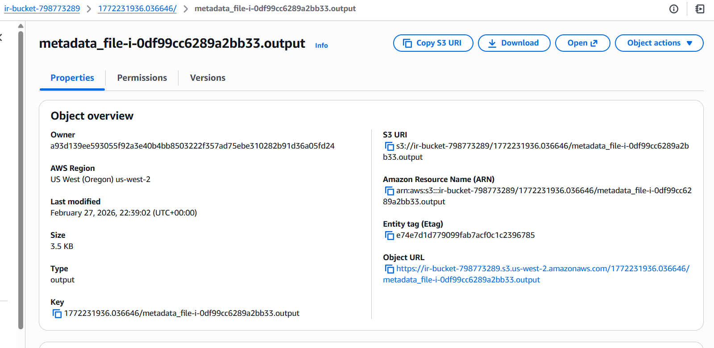

**Instance tags:**

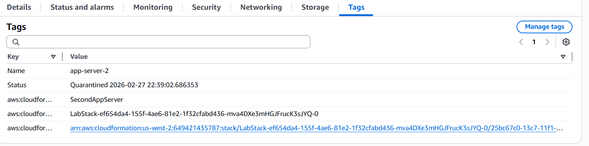

**Security group isolation:**

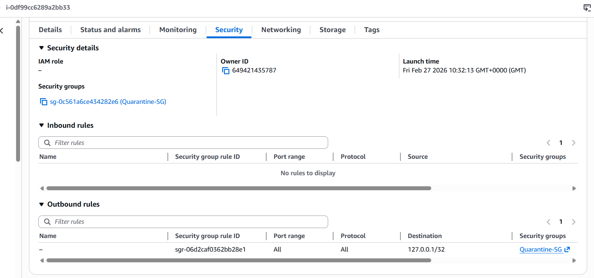

---

## Security Insights & Best Practices

- **Preserve evidence early:** snapshots, metadata in **S3**, and **termination protection** reduce accidental loss during IR.  
- **Limit interactive access** on suspect hosts; prefer **SSM Run Command** / **Session Manager** for controlled, auditable execution.  
- **Contain deliberately:** quarantine **security groups**, **strip instance profiles** that enable lateral movement, and use **tags** for workflow state.  
- **Shrink attack surface:** removing **SSH** in favor of **Session Manager** improves **network posture** and **auditability**.  
- **Automate repeatable containment** for high-volume signals (e.g., brute force) using **CloudWatch Logs → Lambda → EventBridge**.  
- **Align to NIST / PCI-DSS:** map actions to detection, containment, eradication, recovery, and logging/access-control expectations.

---

## AWS Security Specialty Exam Relevance

Reinforces **incident response**, **logging and monitoring**, **infrastructure security**, **IAM**, and **event-driven automation** on AWS—typical themes for the **AWS Certified Security — Specialty** exam.

---

## Personal Reflections

Completing the full **preserve → investigate → harden → automate** arc made tradeoffs tangible: evidence steps feel slow until you treat them as **non-negotiable** for credible IR. The lab’s push away from default **SSH** on compromised systems matches real **forensic hygiene**. Building **CloudWatch → Lambda → EventBridge** containment showed how **consistent, scripted response** scales beyond manual runbooks—something worth documenting with explicit **runbook IDs** and **NIST phase mapping** for stakeholders.
