# Lab 02 - KMS CMK and S3 bucket policy for encryption enforcement

**AWS services:** AWS KMS, Amazon S3, IAM, Amazon EC2 (for CLI / variable setup)

**Frameworks:** NIST, PCI-DSS (data protection and key management align with both)

Screenshots are stored in this repo under [`../../assets/images/lab02-kms-s3-encryption/`](../../assets/images/lab02-kms-s3-encryption/).

---

## Overview

You implement **defense in depth** for object storage: start from **SSE-S3** default encryption, introduce a **customer managed KMS key (CMK)** with **automatic key rotation**, switch the bucket to **SSE-KMS**, and finally enforce—via **bucket policy**—that objects can only be uploaded when clients specify **KMS encryption**. That closes the gap where unencrypted or wrongly encrypted uploads would otherwise succeed.

---

## Objectives

By the end of this lab, you should be able to:

- Create an **AWS KMS customer managed key** and enable **automatic rotation**
- Grant an **IAM role** appropriate **administrative** and **usage** permissions on the key
- Turn on and verify **default encryption** for an **S3** bucket (**lab-bucket**) using **SSE-KMS**
- Upload objects and **verify** the encryption headers / metadata in the console
- Attach a **bucket policy** that **denies** `s3:PutObject` unless the request uses your **KMS key**
- Confirm **Access Denied** for noncompliant uploads and **success** when using the correct encryption parameters

---

## AWS Services Used

| Area | Services |
| ---- | -------- |
| Encryption & keys | **AWS KMS** (CMK, rotation, grants / policies) |
| Object storage | **Amazon S3** (default encryption, bucket policy, objects) |
| Access control | **IAM** (roles for key and workload identity) |
| Compute (optional path in lab) | **Amazon EC2** (environment variables for bucket and key ARNs) |

---

## Step-by-Step Walkthrough

### Context and tasks

High-level diagram / console context from the lab:

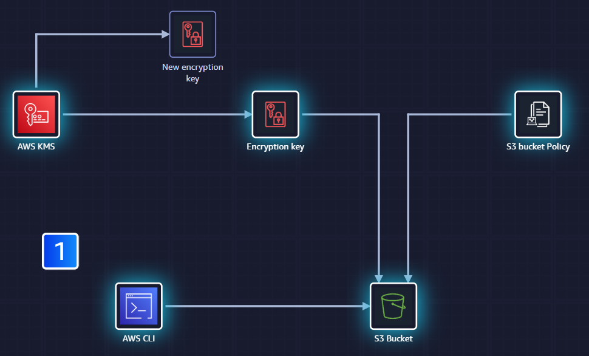

**Tasks:**

- Create an AWS KMS **customer managed key**
- Turn on encryption for data stored in **S3**

### Step 1 — Review current bucket encryption (SSE-S3)

Inspect **default encryption** for the bucket while it still uses **SSE-S3**:

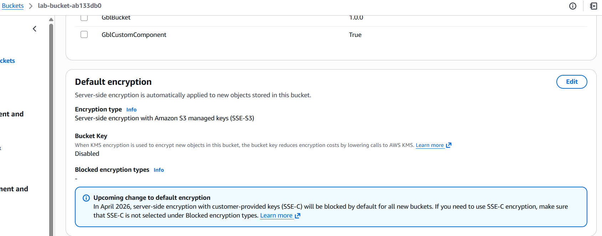

### Step 2 — Create a KMS CMK and enable rotation

Create the **CMK**, assign **key administrators** and **key users** (same **IAM role** as in the lab), then enable **automatic key rotation**.

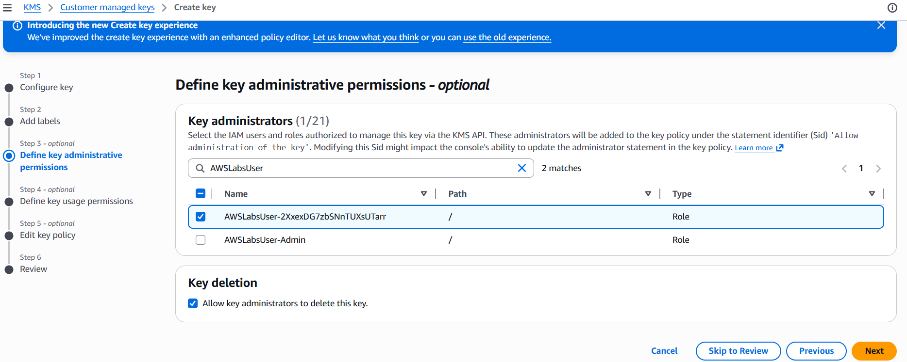

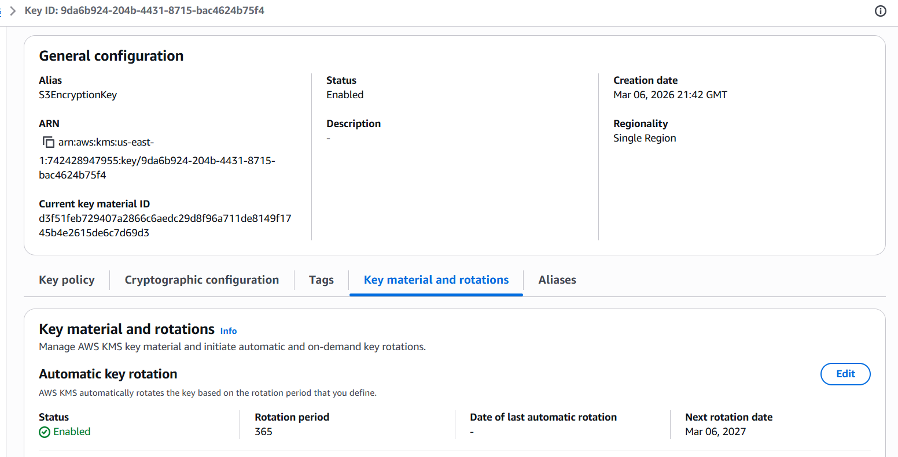

### Step 3 — Configure environment variables (EC2)

On the **EC2** instance, set variables for the **S3 bucket name** and **KMS key ARN** so CLI commands stay consistent.

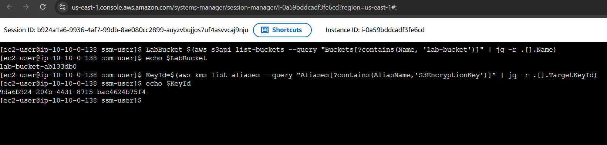

### Step 4 — Update default encryption on `lab-bucket`

Change **default encryption** for **lab-bucket** to use your **KMS CMK** (**SSE-KMS**).

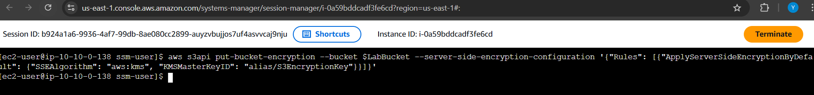

### Step 5 — Confirm default encryption settings

In **Default encryption**, verify **Encryption type** reflects **SSE-KMS** and the expected **KMS key**.

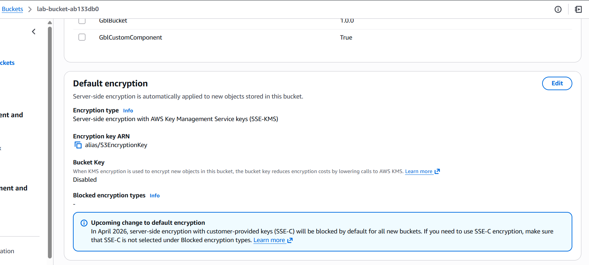

### Step 6 — Upload objects and verify encryption

Upload new objects and confirm in the console that **encryption** is **AWS-KMS** with your key.

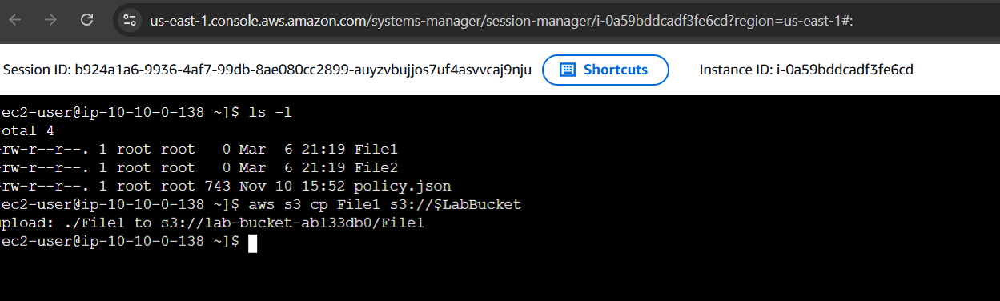

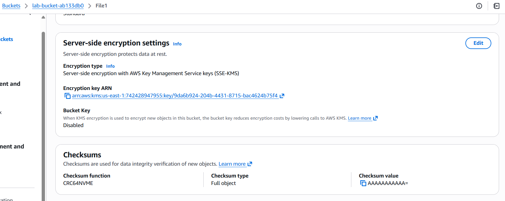

### Step 7 — Require KMS on every upload (bucket policy)

Add a **bucket policy** that **denies** uploads unless **SSE-KMS** uses your key. Replace the **bucket ARN** (and key ARN) with your environment’s values.

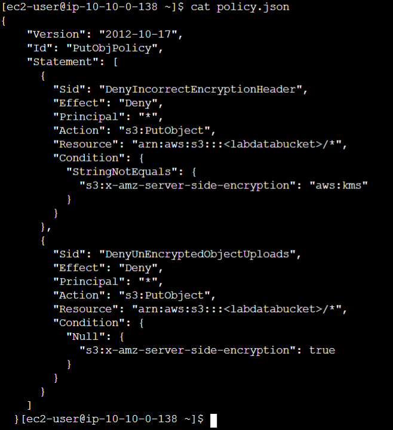

### Step 8 — Attach the policy and test behavior

Attach the policy to the bucket, then attempt uploads **without** proper encryption (**Access Denied** as expected) and **with** the correct method (**success**).

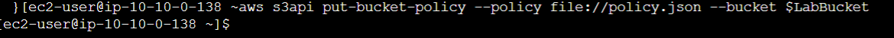

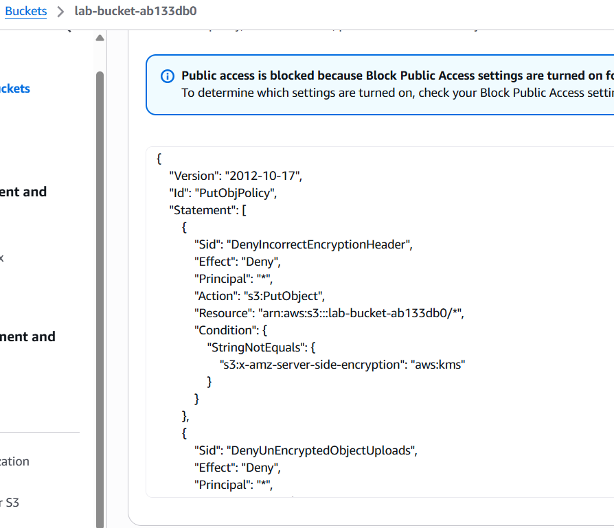

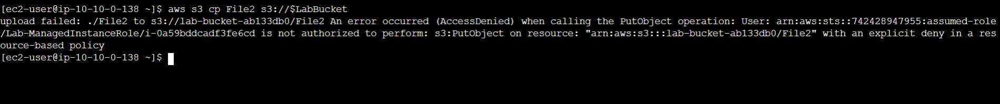

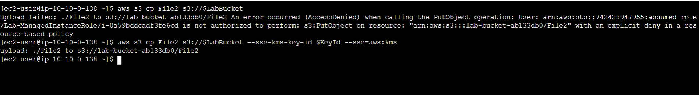

---

## Security Insights & Best Practices

- **Customer managed keys** give you **explicit key policies**, **rotation**, and **audit trails** separate from AWS-owned keys.
- **Default encryption** protects **new objects** but does not always stop clients from **omitting** encryption headers—**bucket policies** close that gap.
- **Least privilege** on the KMS key: separate **administrators** vs **users**, and scope **usage** to the roles that need it.
- **PCI-DSS** and **NIST** both emphasize **strong cryptography**, **key management**, and **demonstrable controls**—a deny-based bucket policy is easy to evidence in assessments.

---

## AWS Security Specialty Exam Relevance

Reinforces **data protection**, **KMS key policies**, **S3 encryption modes** (SSE-S3 vs SSE-KMS), and **resource-based policies**—common **AWS Certified Security — Specialty** topics.

---

## Personal Reflections

Moving from **“encryption on by default”** to **“encryption provably required”** is a small policy change with a large compliance payoff. Pairing **KMS rotation** with **S3 deny statements** makes the control **testable** and **repeatable**, which matters more than any single console screenshot.
