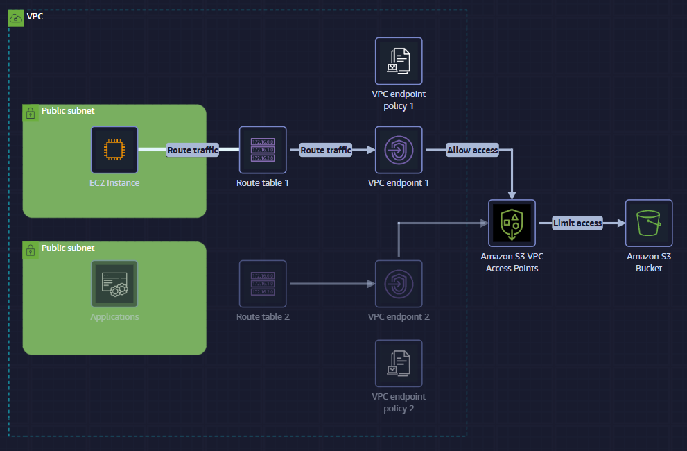
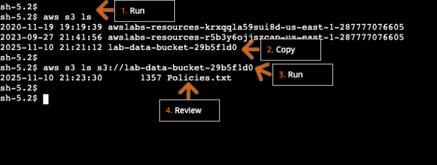
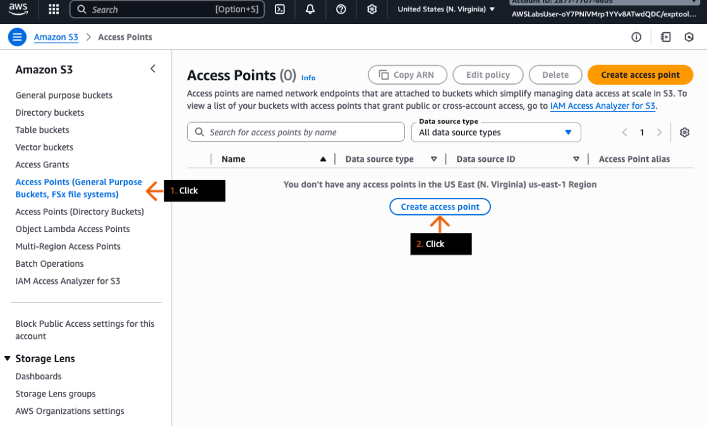
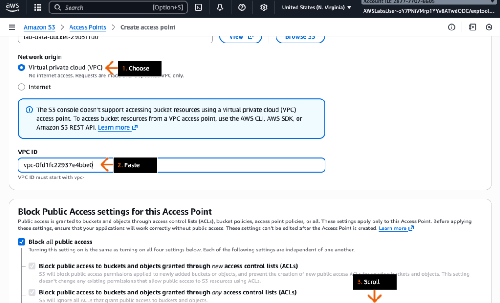
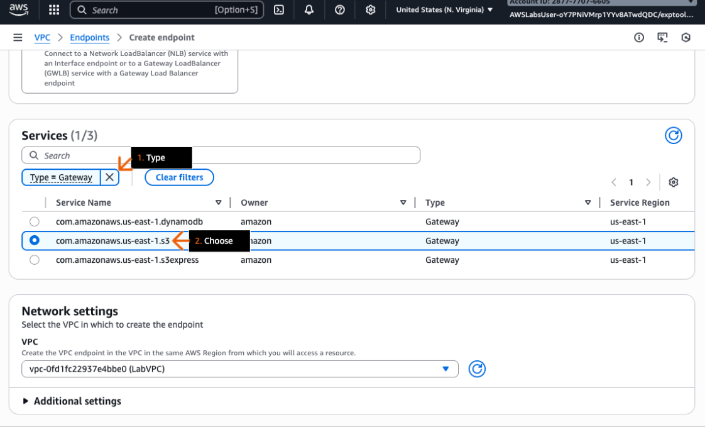
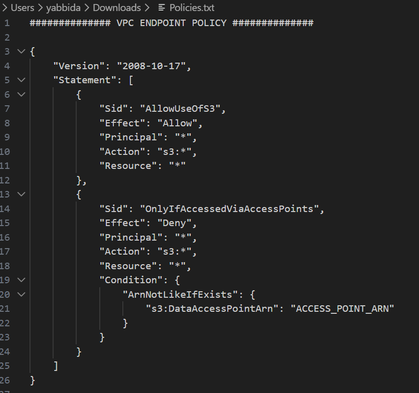
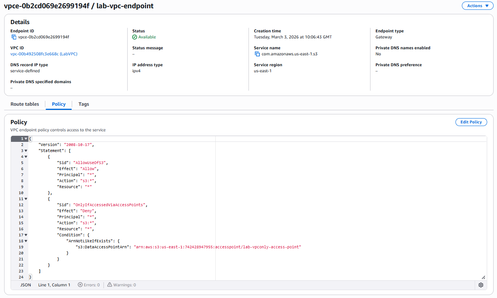
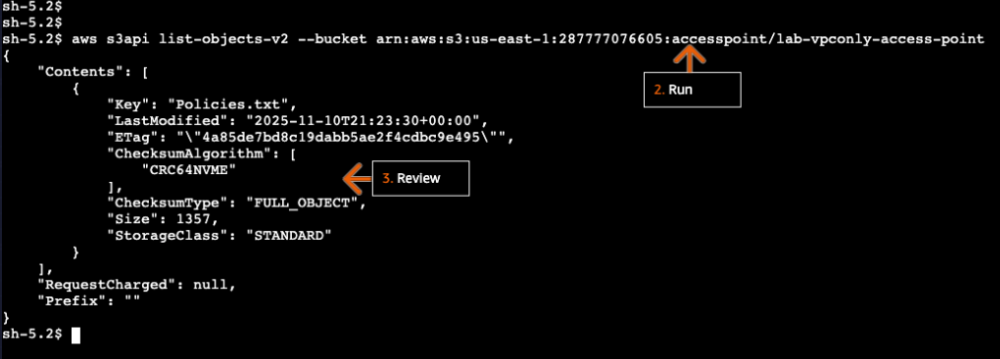
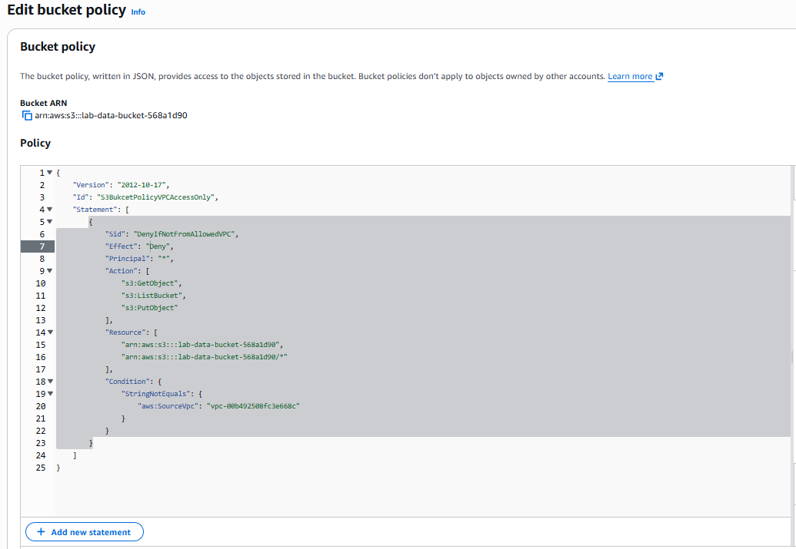
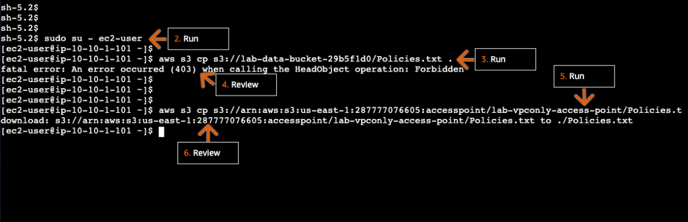

# Lab 03 - Network Security (two labs)

This folder documents **two** related labs. Screenshots live in:

- **Lab 03A:** [`../../assets/images/lab03a-vpc-s3-access-point/`](../../assets/images/lab03a-vpc-s3-access-point/)
- **Lab 03B:** [`../../assets/images/lab03b-network-firewall-threat-hunting/`](../../assets/images/lab03b-network-firewall-threat-hunting/)

---

# Lab 03A - VPC-only S3 access point, gateway endpoint, and bucket policy

**AWS services:** Amazon VPC, Amazon S3 (access points), **gateway VPC endpoints**, IAM, Amazon EC2

## Overview

You use **S3 access points** together with a **gateway VPC endpoint** and **endpoint policy** so that **only traffic from a specific VPC** can reach shared datasets, and so that **S3 access is limited to requests made through the access point** (not arbitrary bucket-global URLs). A **bucket policy** further restricts access to the **VPC context** (e.g., **VPC ID**), supporting **least privilege** for data access from application subnets.

## Objectives

By the end of this lab, you should understand how to:

- Explain how **VPC network origin** on an access point **rejects** requests that do not originate from the designated **VPC**
- Create a **VPC-only access point** tied to an **S3 bucket**
- Create a **gateway VPC endpoint** for **S3** with a policy that **allows access only via the access point ARN**
- Use **route tables** so **EC2** traffic to the access point goes through the **VPC endpoint**
- Apply a **bucket policy** that scopes access to your **VPC** and validate **list/get** via the access point from **EC2**

## AWS Services Used

| Area | Services |
| ---- | -------- |
| Networking | **Amazon VPC**, **route tables**, **gateway VPC endpoints** |
| Storage & access | **Amazon S3**, **S3 access points** |
| Compute | **Amazon EC2** (CLI: `aws s3api` against access point) |

## Step-by-Step Walkthrough

### Conceptual steps (Steps 1–8)

- **Step 1:** Streamline application access using **access points** plus **VPC endpoint policies** for shared datasets.
- **Step 2:** Access points provide **distinct hostnames** with their own **permissions** and **network controls**.
- **Step 3:** A **VPC** network origin causes S3 to **reject** requests not from that VPC.
- **Step 4:** Create a **VPC-only access point** on the bucket.
- **Step 5:** Add a **gateway VPC endpoint** for S3.
- **Step 6:** Endpoint policy **allows S3 only through the access point**.
- **Step 7:** **Route tables** send access-point traffic to the endpoint.
- **Step 8:** Optional second endpoint / policy pattern for **other subnets**.

### Hands-on configuration

**Access the bucket without the access point** (baseline / comparison):

**Create the access point:**

**Associate the access point with the VPC** where the instance runs:

**Create the gateway endpoint** for S3:

**Endpoint policy** — allow calls only when using the **access point ARN** (substitute your ARNs):

**Test access via the access point:**

**Bucket policy** — restrict the bucket so it is reachable only from this **VPC** (resource policy with **VPC ID**):

**CLI listing / download** using the access point alias:

## Security Insights & Best Practices (Lab 03A)

- **Access points** reduce **blast radius** compared with a single **bucket-wide** permission model.
- **Gateway endpoints** keep **S3 traffic on the AWS network**; policies can **bind** that path to **specific ARNs** (access points).
- **Bucket policies** that assert **VPC context** help enforce **“only from my network”** in addition to **identity** policies.

## AWS Security Specialty Exam Relevance (Lab 03A)

Touches **VPC connectivity**, **S3 access points**, **endpoint policies**, and **defense in depth** for data paths.

## Personal Reflections (Lab 03A)

The combination **access point + endpoint policy + bucket policy** is easy to mix up in exams and in design reviews—drawing the **request path** (instance → route table → endpoint → access point → bucket) once saves a lot of confusion later.

---

# Lab 03B - Threat hunting with AWS Network Firewall

**AWS services:** AWS Network Firewall, Amazon Route 53 Resolver DNS Firewall, AWS Transit Gateway (lab architecture), Amazon CloudWatch Logs, **CloudWatch Logs Insights**, **Contributor Insights**, Amazon EC2, Amazon VPC

## Overview

As **AnyCompany’s** first network security engineer, you address **weak visibility** into egress traffic and suspected **compromised EC2** instances. You implement **AWS Network Firewall** for **stateful inspection** (including **Suricata-compatible** rules) and **Route 53 Resolver DNS Firewall** for **DNS-layer** enforcement and visibility. Together they support **egress filtering**, **DNS monitoring**, and **threat hunting** to find **rogue instances**.

## Objectives

By the end of this lab, you should be able to:

- Configure **stateful rule groups** in **Network Firewall** using **Suricata-compatible IPS** syntax
- Build **DNS Firewall** rules using **managed** and **custom** domain lists to **alert** or **block** suspicious queries
- Use **Logs Insights** and **Contributor Insights** to identify **noisy or compromised** EC2 instances from **DNS** and **firewall** logs

## AWS Services Used

| Area | Services |
| ---- | -------- |
| Firewall & DNS | **AWS Network Firewall**, **Route 53 Resolver DNS Firewall** |
| Network fabric | **Amazon VPC**, **Transit Gateway**, **firewall endpoints** |
| Observability | **CloudWatch Logs**, **Logs Insights**, **Contributor Insights** |
| Compute | **Amazon EC2** |

## Step-by-Step Walkthrough

### Architecture and theory

Traffic path (conceptual): **EC2** → **DNS Firewall** (query inspection) → **Network Firewall** (stateful inspection, Suricata, domain lists) → **Internet Gateway**.

**DNS Firewall** and **Network Firewall** are **complementary**: DNS Firewall catches **malicious resolution** early; Network Firewall handles **IPs**, **ports**, and **non-DNS** abuse. **Cost note:** Network Firewall bills per **endpoint per AZ** and **per GB processed**—multi-AZ designs multiply fixed cost.

**Why DNS Firewall matters:** non-HTTP protocols, **raw TCP** to resolved IPs, **DNS tunneling**, and **managed threat intel lists** at the DNS layer.

### Task 1 — Explore the network architecture

**Consider:** The **VPC endpoints** in the inspection path are **firewall endpoints**. They connect the **Inspection-Egress-VPC** to **Network Firewall**, letting **Transit Gateway** traffic be **inspected** before **NAT Gateway** egress.

### Task 2 — Stateful firewall rules

Firewall **VPC attachment**, subnets, and endpoints:

#### Task 2.2 — Suricata IPS example

Example rule:

`alert tcp any any <> any 443 (msg:"SURICATA Port 443 but not TLS"; flow:to_server,established; app-layer-protocol:!tls; sid:2271003; rev:1;)`

**Rule breakdown:** **TCP/443** traffic where the application layer is **not TLS** on an **established** flow to the server—useful for spotting **cleartext** or **misuse** of **443/tcp**.

#### Attach the rule group to the firewall

#### Task 2.3 — Managed rule groups

### Task 3 — Route 53 Resolver DNS Firewall

HTTP/HTTPS domain lists alone do not stop **other protocols** to the same names. **DNS Firewall** blocks **resolution** of suspect domains from VPC workloads.

**Second rule** and additional DNS policy screens:

**Send DNS query logs to CloudWatch:**

### Task 4 — Threat hunting

**Contributor Insights** / **Logs Insights** on **Route 53 Resolver** logs:

**Compromised instance** indicators:

**Network Firewall** — **Logs Insights**:

**Alert example:** log indicates **FTP on port 443** (unexpected application on **443/tcp**):

### Task 5 — DNS exfiltration (encoding)

Encoded **base64** payload and decode step:

### Task 6 — Quarantine

Move compromised instances to a **quarantine security group**:

## Security Insights & Best Practices (Lab 03B)

- **Layer DNS and packet inspection**; neither replaces the other.
- **Suricata** rules express **behavior** (e.g., “443 but not TLS”) that pure **port ACLs** miss.
- **Centralized logging** to **CloudWatch** enables **correlation** and **entity-centric** hunting (**Contributor Insights**).
- **Quarantine SGs** are a simple, auditable **containment** lever after **hunting** confirms suspicion.

## AWS Security Specialty Exam Relevance (Lab 03B)

Strong alignment with **AWS Network Firewall**, **DNS Firewall**, **logging/monitoring**, and **VPC egress** control patterns.

## Personal Reflections (Lab 03B)

The lab makes **DNS vs Network Firewall** responsibilities obvious in hindsight but easy to blur under time pressure. **Writing one paragraph** of “what each control sees” next to the architecture diagram is worth keeping for interviews and incident reviews.
