# Lab 03B - Threat hunting with AWS Network Firewall

**AWS services:** AWS Network Firewall, Amazon Route 53 Resolver DNS Firewall, AWS Transit Gateway (lab architecture), Amazon CloudWatch Logs, **CloudWatch Logs Insights**, **Contributor Insights**, Amazon EC2, Amazon VPC

**Screenshots:** [`../../assets/images/lab03b-network-firewall-threat-hunting/`](../../assets/images/lab03b-network-firewall-threat-hunting/)

---

## Overview

As **AnyCompany’s** first network security engineer, you address **weak visibility** into egress traffic and suspected **compromised EC2** instances. You implement **AWS Network Firewall** for **stateful inspection** (including **Suricata-compatible** rules) and **Route 53 Resolver DNS Firewall** for **DNS-layer** enforcement and visibility. Together they support **egress filtering**, **DNS monitoring**, and **threat hunting** to find **rogue instances**.

**How to read the walkthrough:** Tasks progress from **understanding topology** → **configuring inspection** → **DNS policy** → **log-driven hunting** → **containment**. Under each screenshot group, notes describe **what layer of the stack** you are viewing and **what hypothesis** you would test as an analyst.

---

## Objectives

By the end of this lab, you should be able to:

- Configure **stateful rule groups** in **Network Firewall** using **Suricata-compatible IPS** syntax
- Build **DNS Firewall** rules using **managed** and **custom** domain lists to **alert** or **block** suspicious queries
- Use **Logs Insights** and **Contributor Insights** to identify **noisy or compromised** EC2 instances from **DNS** and **firewall** logs

---

## AWS Services Used

| Area | Services |
| ---- | -------- |
| Firewall & DNS | **AWS Network Firewall**, **Route 53 Resolver DNS Firewall** |
| Network fabric | **Amazon VPC**, **Transit Gateway**, **firewall endpoints** |
| Observability | **CloudWatch Logs**, **Logs Insights**, **Contributor Insights** |
| Compute | **Amazon EC2** |

---

## Step-by-Step Walkthrough

### Architecture and theory

Traffic path (conceptual): **EC2** → **DNS Firewall** (query inspection) → **Network Firewall** (stateful inspection, Suricata, domain lists) → **Internet Gateway**.

**DNS Firewall** and **Network Firewall** are **complementary**: DNS Firewall catches **malicious resolution** early; Network Firewall handles **IPs**, **ports**, and **non-DNS** abuse. **Cost note:** Network Firewall bills per **endpoint per AZ** and **per GB processed**—multi-AZ designs multiply fixed cost.

**Why DNS Firewall matters:** non-HTTP protocols, **raw TCP** to resolved IPs, **DNS tunneling**, and **managed threat intel lists** at the DNS layer.

### Task 1 — Explore the network architecture

**Goal:** Before changing rules, map **where inspection happens** relative to **Transit Gateway**, **inspection VPC**, **NAT**, and **firewall endpoints**. Threat hunting fails if you cannot explain **which log source** proves **which hop** dropped or allowed traffic.

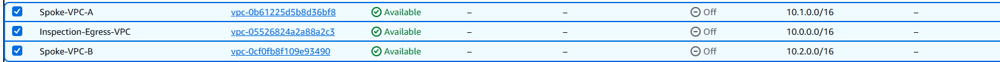

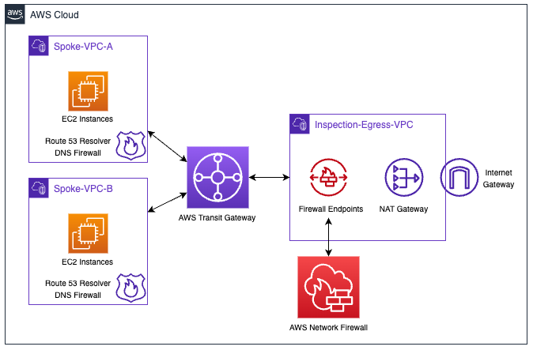

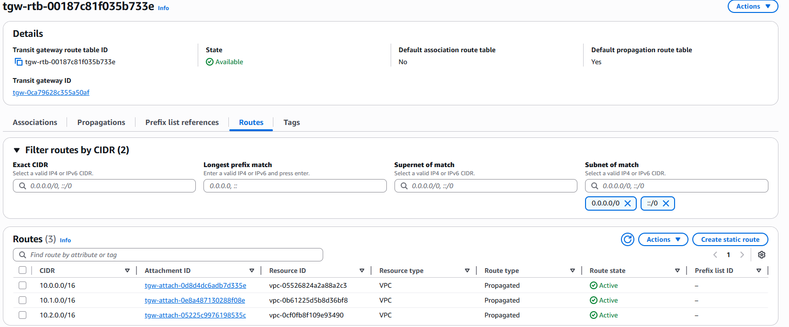

**What you're seeing (sequence):** High-level **VPC and TGW** layout, then progressively **zoomed** views of how **spoke** (or workload) VPCs attach and where **egress** is funneled. **Takeaway:** Centralized inspection trades **operational complexity** for **consistent policy**.

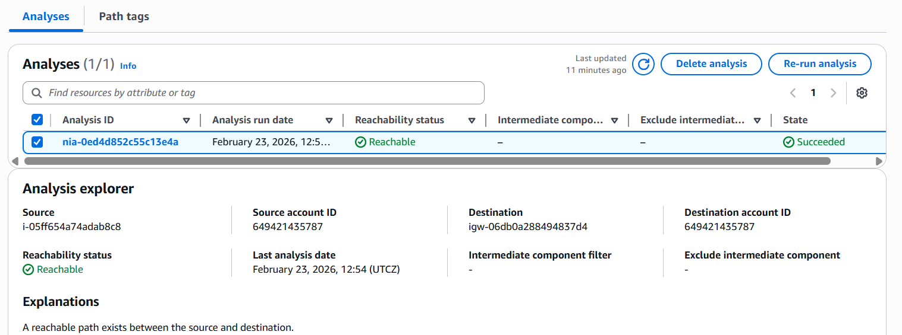

**What you're seeing:** A **detailed** segment—often **inspection VPC** subnets, **route table** intent, or **attachment** IDs. **Interview question you can answer:** “Why not only **security groups**?” — SGs are **stateful instance-level**; **Network Firewall** provides **IPS**, **domain lists**, and **centralized logging** for **egress**.

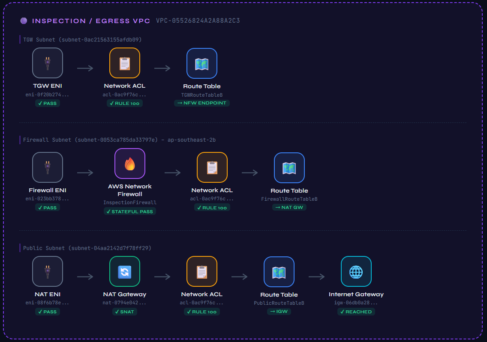

**What you're seeing:** The **inspection path** annotated—traffic **enters** firewall subnets before **NAT** egress. **Consider:** The **VPC endpoints** in the inspection path are **firewall endpoints**. They connect the **Inspection-Egress-VPC** to **Network Firewall**, letting **Transit Gateway** traffic be **inspected** before **NAT Gateway** egress.

### Task 2 — Stateful firewall rules

**Goal:** Deploy **Network Firewall** with subnets, **firewall policy**, and **stateful rule groups** so **Suricata** logic can alert on **protocol abuse** (e.g., non-TLS on **443/tcp**).

Firewall **VPC attachment**, subnets, and endpoints:

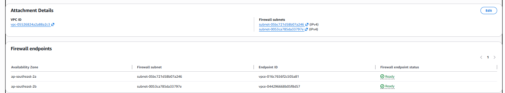

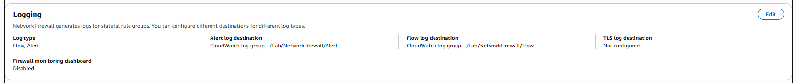

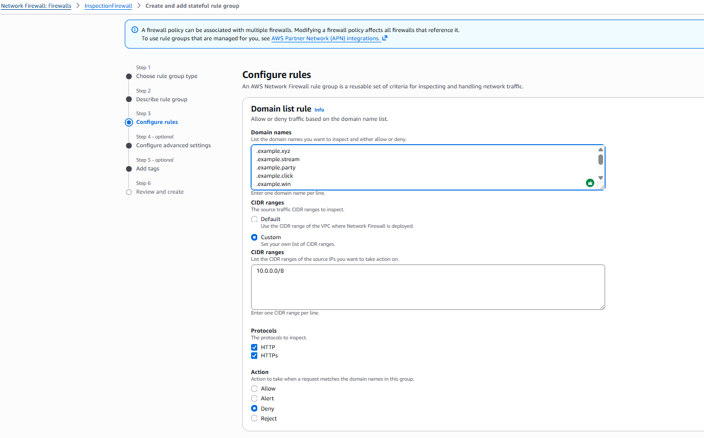

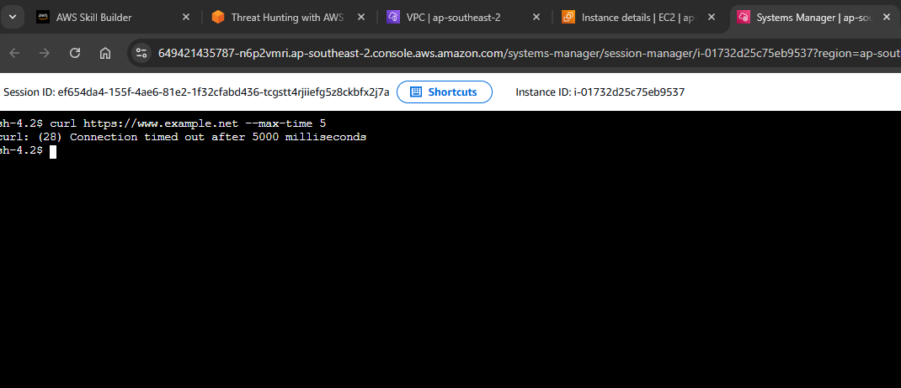

**What you're seeing:** Creation or review of **firewall subnets** (dedicated /26-style CIDRs per AZ in the lab), **firewall resource**, and **endpoint** placement. **Why dedicated subnets:** Firewall endpoints need **correct routing**; mixing with generic app subnets breaks **asymmetric routing** patterns.

#### Task 2.2 — Suricata IPS example

Example rule:

`alert tcp any any <> any 443 (msg:"SURICATA Port 443 but not TLS"; flow:to_server,established; app-layer-protocol:!tls; sid:2271003; rev:1;)`

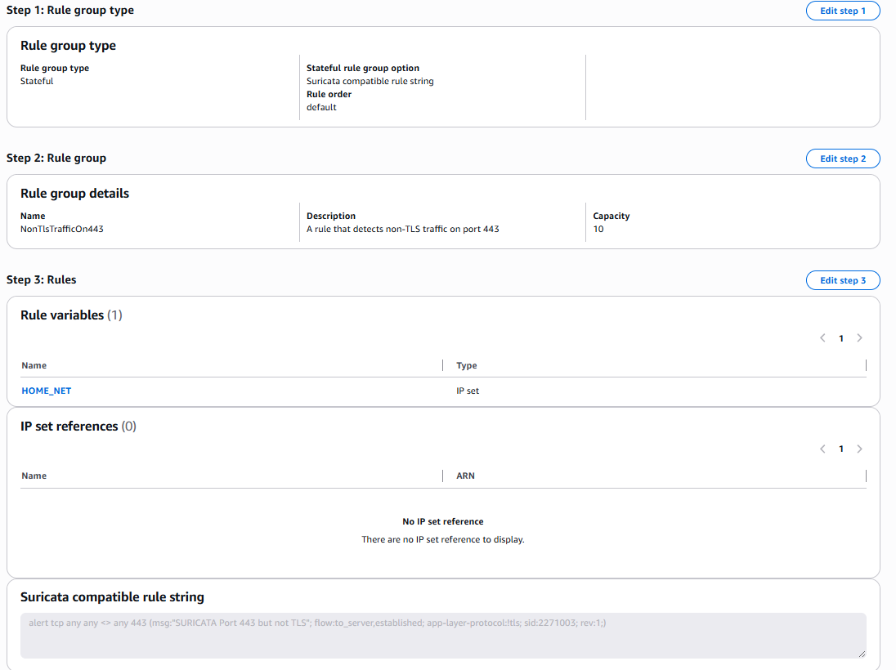

**What you're seeing:** **Suricata** rule text in **Network Firewall** stateful rule group editor or review screen. **Rule breakdown:** **TCP/443** traffic where the application layer is **not TLS** on an **established** flow to the server—useful for spotting **cleartext** or **misuse** of **443/tcp** (e.g., **FTP** tunneled or mistaken listeners).

#### Attach the rule group to the firewall

**Goal:** Associate the **stateful rule group** with a **firewall policy** attached to your **firewall** so evaluation happens on live flows.

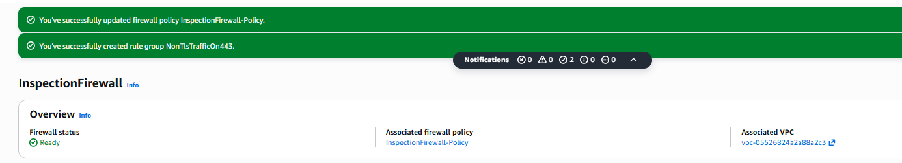

**What you're seeing:** **Firewall policy** composition—**stateless** + **stateful** group ordering and **default actions**. **Verify:** Policy version increments when you add groups.

#### Task 2.3 — Managed rule groups

**Goal:** Augment custom Suricata with **AWS-managed** **threat signature** bundles where the lab enables them—faster time-to-value for known **IPS** coverage.

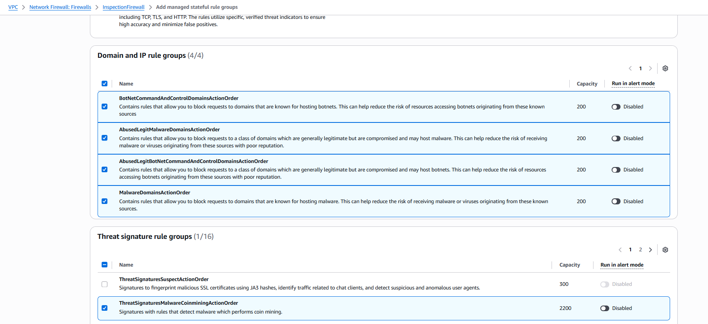

**What you're seeing:** **Managed rule groups** selection (e.g., **Strict order** / **Suricata compatible** AWS collections). **Tradeoff:** More rules → more **log volume** and **false positives**—tune in **alert** mode before **block** in production.

### Task 3 — Route 53 Resolver DNS Firewall

**Goal:** Stop **bad domains** at **resolution** time. **HTTP domain lists** on the firewall alone do not block **other protocols** to IPs learned from DNS—**DNS Firewall** addresses the **name → address** step.

HTTP/HTTPS domain lists alone do not stop **other protocols** to the same names. **DNS Firewall** blocks **resolution** of suspect domains from VPC workloads.

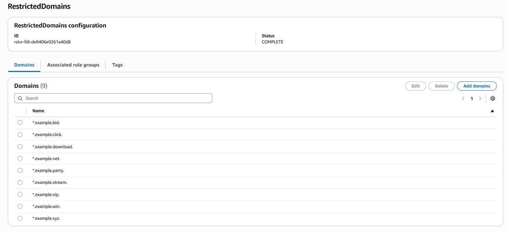

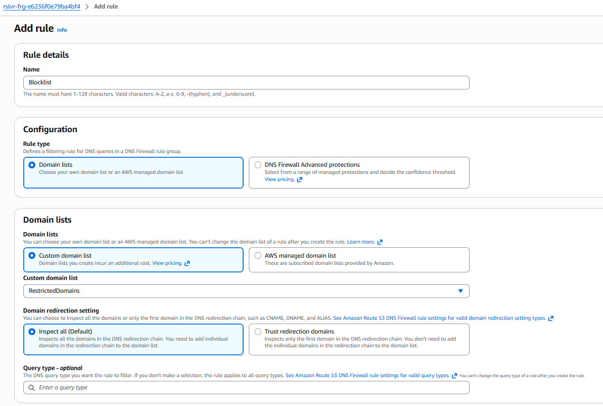

**What you're seeing:** **Rule groups** and **priorities**—**ALLOW** trusted domains, **BLOCK** threat lists, **ALERT** for visibility-first rollout. **Hunting angle:** **ALERT** rules generate **Resolver query logs** without breaking apps while you baseline.

**Second rule** and additional DNS policy screens:

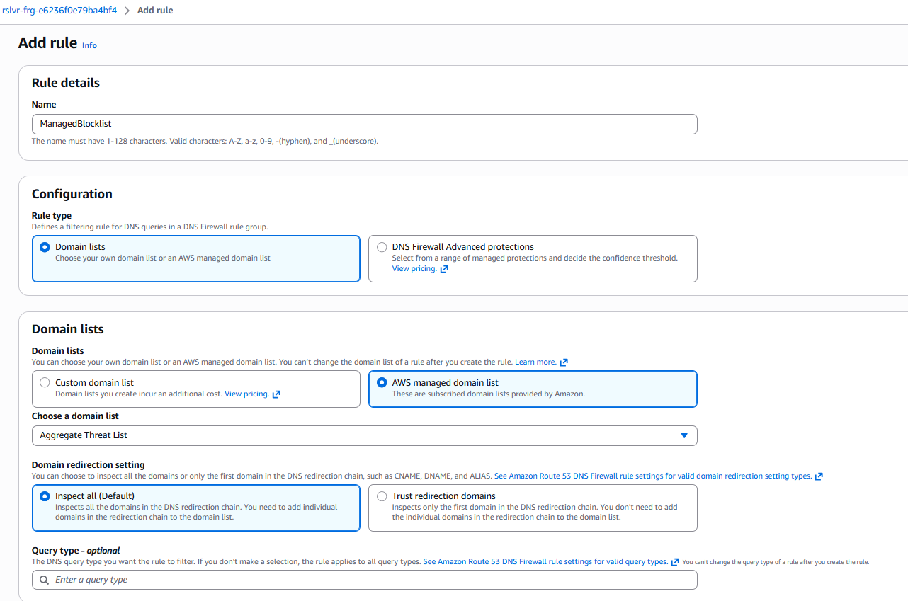

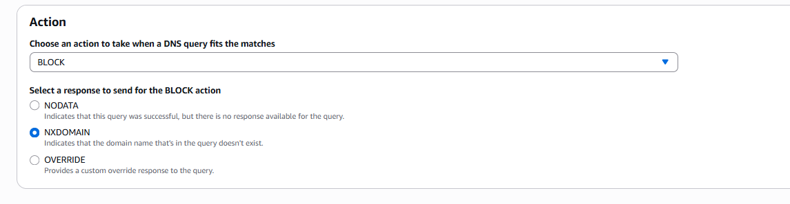

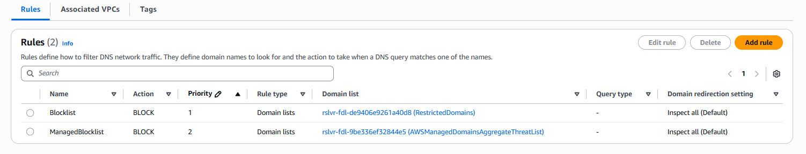

**What you're seeing:** **VPC association** of DNS Firewall rule group to **Resolver**, and **ordering** when multiple rules match. **Common pitfall:** Forgetting to associate the **VPC**—rules exist but **no queries** are evaluated.

**Send DNS query logs to CloudWatch:**

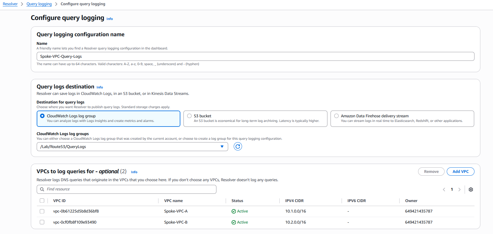

**What you're seeing:** **Resolver query logging** configuration targeting a **CloudWatch Logs** log group. **Why:** **Logs Insights** and **Contributor Insights** need **structured** query logs with **instance IP** / **VPC** dimensions.

### Task 4 — Threat hunting

**Goal:** Shift from **configuration** to **analysis**—find **outliers**: rare domains, **spikes** per instance, or **correlation** between **DNS** and **firewall alert** logs.

#### Resolver logs — Contributor Insights / Logs Insights

**Contributor Insights** / **Logs Insights** on **Route 53 Resolver** logs:

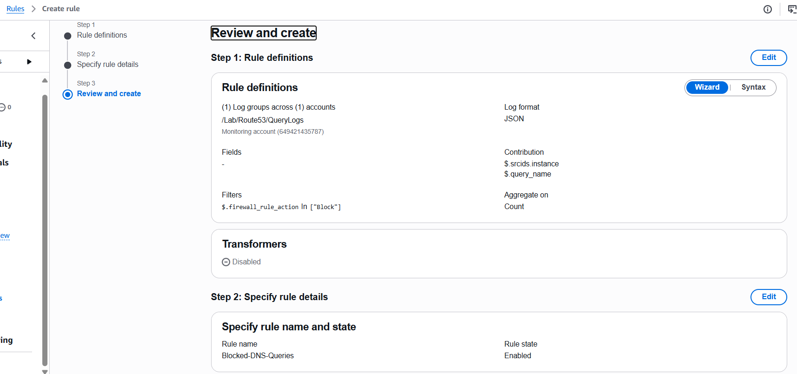

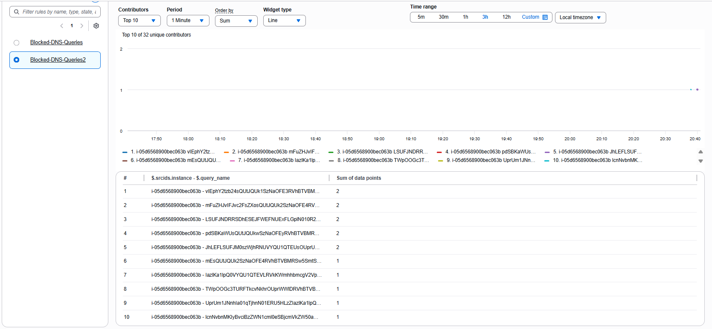

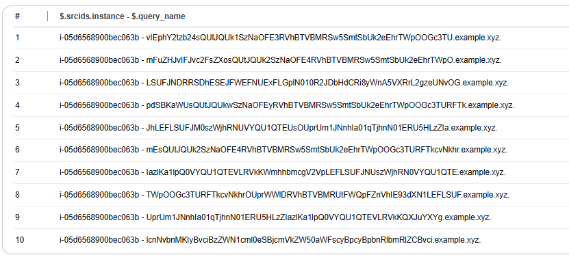

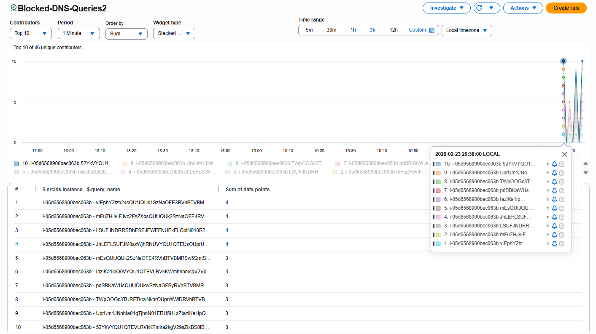

**What you're seeing:** **Logs Insights** queries (e.g., **`stats count()` by `query_name` or `srcaddr`**) and/or **Contributor Insights** rules highlighting **top talkers**. **Narrative:** “Which **EC2** is generating **anomalous DNS volume** or **rare TLDs**?”

**Compromised instance** indicators:

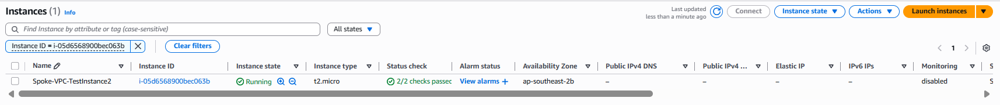

**What you're seeing:** A **specific instance** or **IP** surfaced as **suspicious** from log aggregation—often paired with **domain** or **query type** anomalies. **Next step:** Pivot to **Network Firewall** logs for the **same** **5-tuple** window.

#### Network Firewall — Logs Insights

**Network Firewall** — **Logs Insights**:

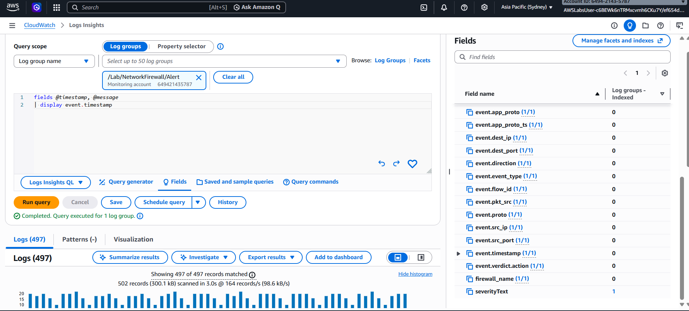

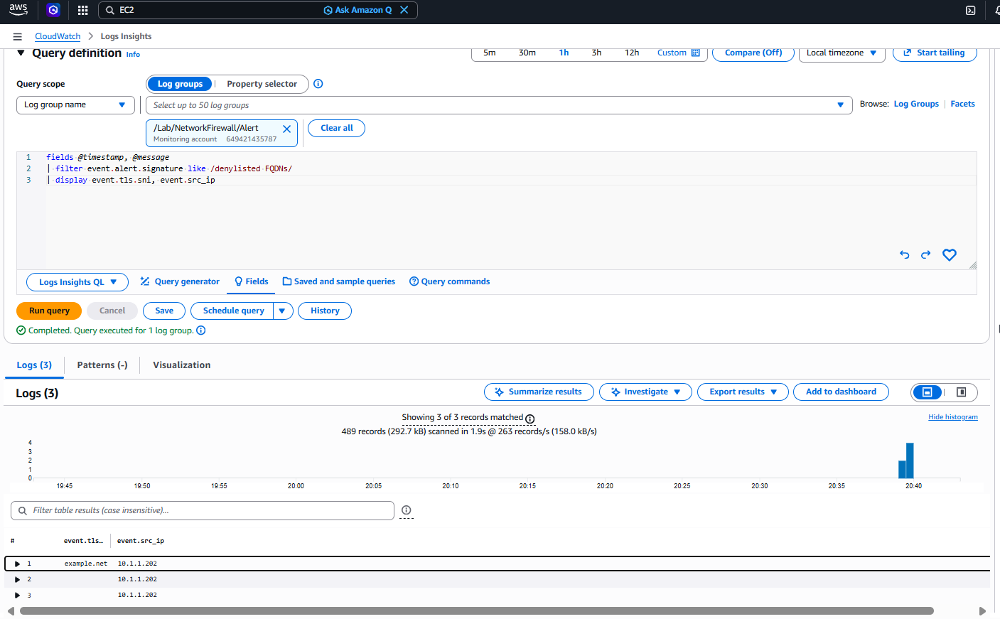

**What you're seeing:** **Alert** and **flow** logs (lab enables subset) queried for **signature ID**, **action**, or **app-layer** metadata. **Correlation story:** **DNS** asked for **domain X**; **firewall** saw **non-TLS on 443** to **IP Y**—stronger **incident hypothesis** than either log alone.

**Alert example:** log indicates **FTP on port 443** (unexpected application on **443/tcp**):

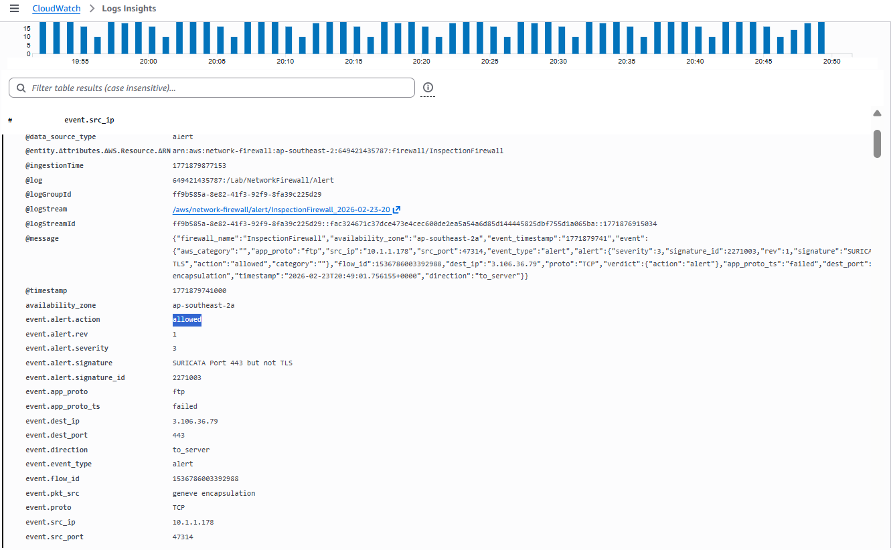

**What you're seeing:** A concrete **alert** matching the **Suricata** “443 but not TLS” style logic—**FTP** control channel on **443** is **dual-use** evasion. **Remediation preview:** **block** rule, **isolate** instance (**Task 6**), **IR** ticket with **timeline**.

### Task 5 — DNS exfiltration (encoding)

**Goal:** Practice **decoding** **DNS tunneling** / **encoded** subdomains—threat hunters must move from **“weird query”** to **payload**.

Encoded **base64** payload and decode step:

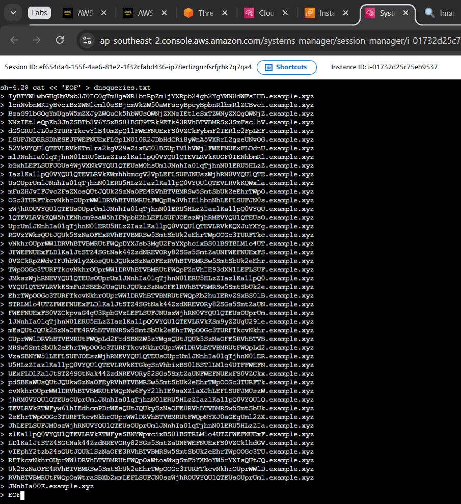

**What you're seeing:** **Resolver** or **packet capture** excerpt with **long subdomain** labels—often **base64**-like character sets. **Why attackers use DNS:** Many networks **allow** **UDP/53** outbound even when **HTTP** is proxied.

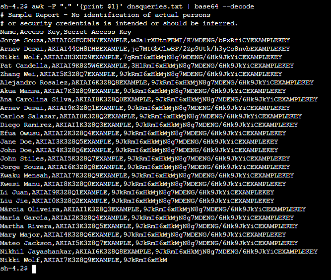

**What you're seeing:** **Decoded** string (e.g., **hostname**, **token**, or **file chunk** per lab). **Talking point:** **Detection** = **entropy** + **length** + **frequency**; **Prevention** = **DNS Firewall** + **egress proxy** + **limited resolvers**.

### Task 6 — Quarantine

**Goal:** After **hunting** supports suspicion, apply **network containment**—**quarantine security group** with **deny-by-default** or **SOC-approved** exceptions.

Move compromised instances to a **quarantine security group**:

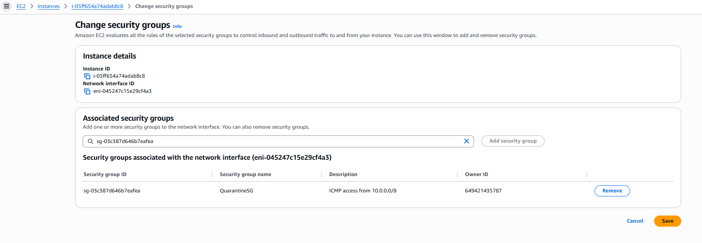

**What you're seeing:** Instance **ENI** moved to **Quarantine-SG** (or rules updated **in place**). **Pair with:** **Config rule** / **tag** (`Quarantined`) and **ticket** reference—**process**, not only **technology**.

---

## Security Insights & Best Practices

- **Layer DNS and packet inspection**; neither replaces the other.
- **Suricata** rules express **behavior** (e.g., “443 but not TLS”) that pure **port ACLs** miss.
- **Centralized logging** to **CloudWatch** enables **correlation** and **entity-centric** hunting (**Contributor Insights**).
- **Quarantine SGs** are a simple, auditable **containment** lever after **hunting** confirms suspicion.

---

## AWS Security Specialty Exam Relevance

Strong alignment with **AWS Network Firewall**, **DNS Firewall**, **logging/monitoring**, and **VPC egress** control patterns.

---

## Personal Reflections

The lab makes **DNS vs Network Firewall** responsibilities obvious in hindsight but easy to blur under time pressure. **Writing one paragraph** of “what each control sees” next to the architecture diagram is worth keeping for interviews and incident reviews.
