# Lab 04 - Automate infrastructure compliance with AWS Config

**AWS services:** AWS Config, AWS Systems Manager Automation (as used for remediation in the lab flow), Amazon EC2, Amazon S3, IAM

**Frameworks:** Governance, risk, and compliance (GRC) practices aligned with **continuous compliance** and **audit readiness**

Screenshots are stored in this repo under [`../../assets/images/lab04-aws-config-compliance/`](../../assets/images/lab04-aws-config-compliance/).

---

## Overview

As a **cloud security administrator** at **AnyCompany**, you must protect a growing inventory of **EC2** instances (application testing) and **S3** buckets (intellectual property). The organization needs to **discover resources**, **evaluate configuration** against policy, **detect drift**, and **remediate automatically** instead of relying on one-off manual fixes.

This lab walks through **AWS Config**: resource inventory, **managed rules**, **remediation actions**, and the **Config dashboard** for ongoing compliance visibility.

---

## Objectives

By the end of this lab, you will be able to:

- Apply **AWS Config managed rules** to selected resources
- Configure **automated remediation** triggered by **noncompliant** evaluations
- Use the **AWS Config dashboard** to monitor **resource compliance** over time

---

## AWS Services Used

| Area | Services |
| ---- | -------- |
| Compliance & inventory | **AWS Config** (recorders, rules, conformance packs as applicable) |
| Remediation | **AWS Systems Manager Automation** (or **Config**-managed remediation actions, per lab) |
| Resources in scope | **Amazon EC2**, **Amazon S3**, **IAM** identities referenced by rules |

---

## Step-by-Step Walkthrough

The following screenshots follow the lab progression: enabling and exploring **Config**, attaching **managed rules**, observing **noncompliance**, executing **remediation**, and confirming **compliant** state in the **dashboard**.

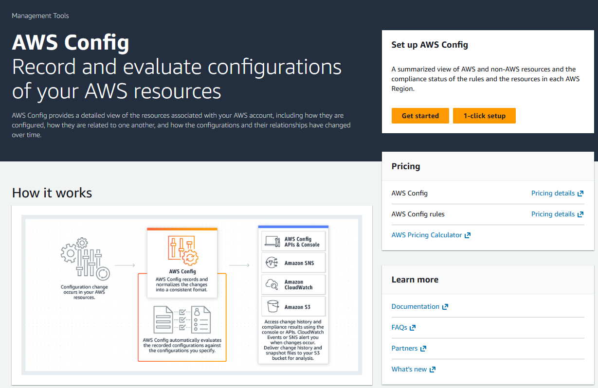

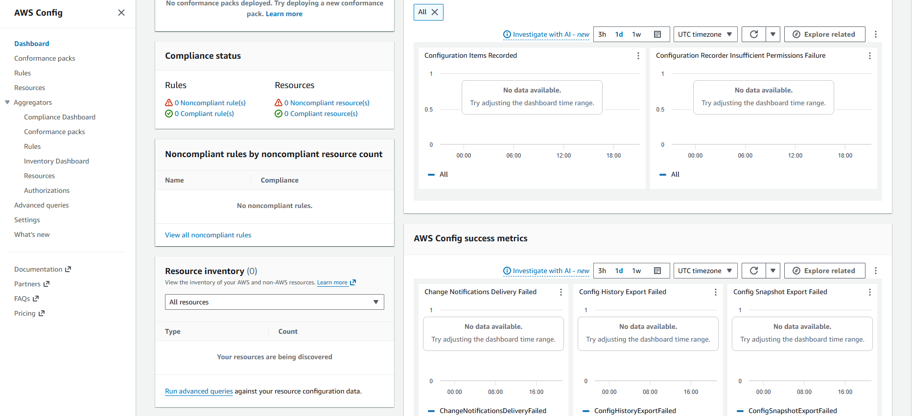

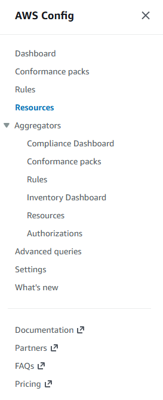

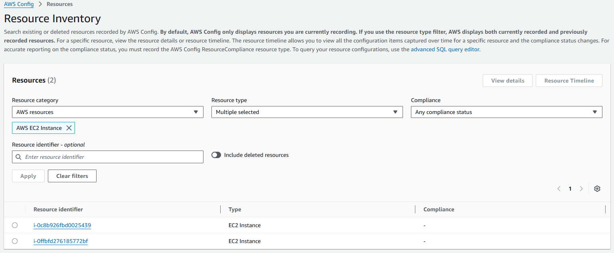

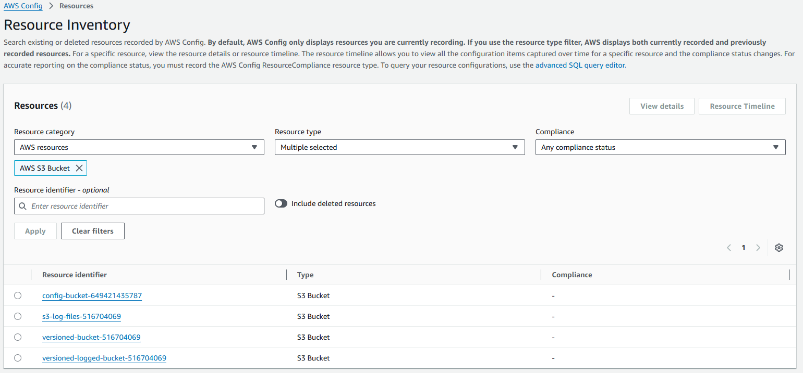

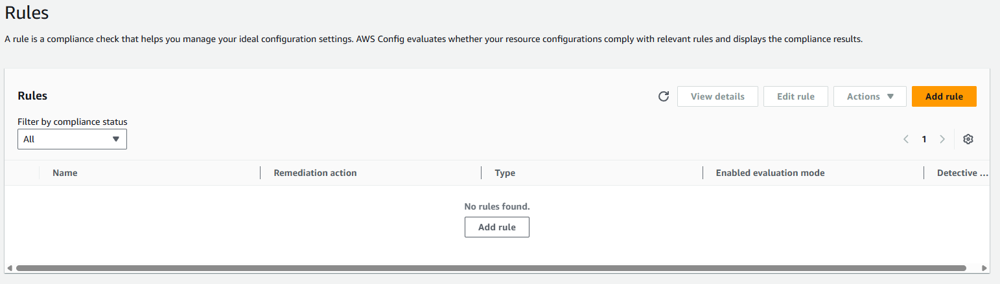

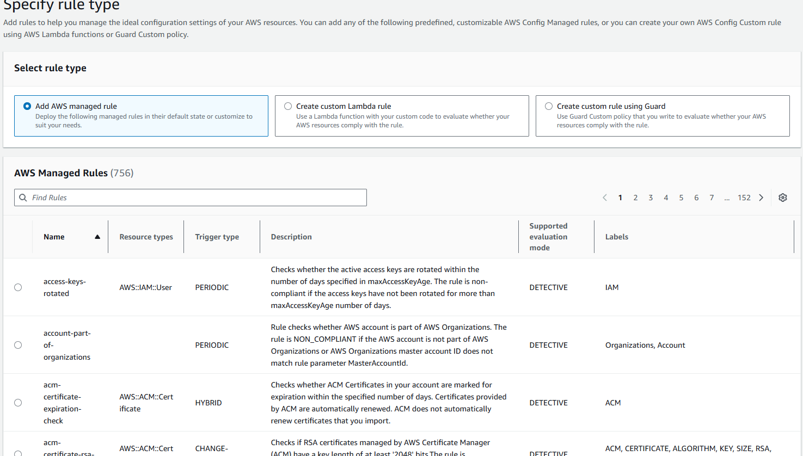

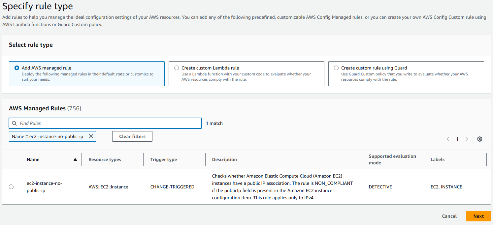

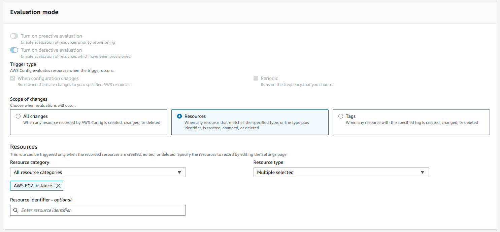

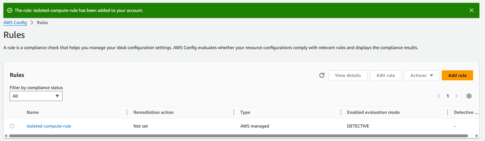

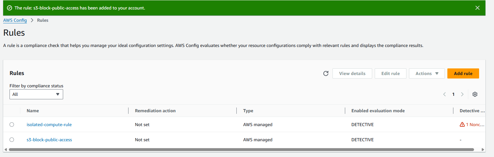

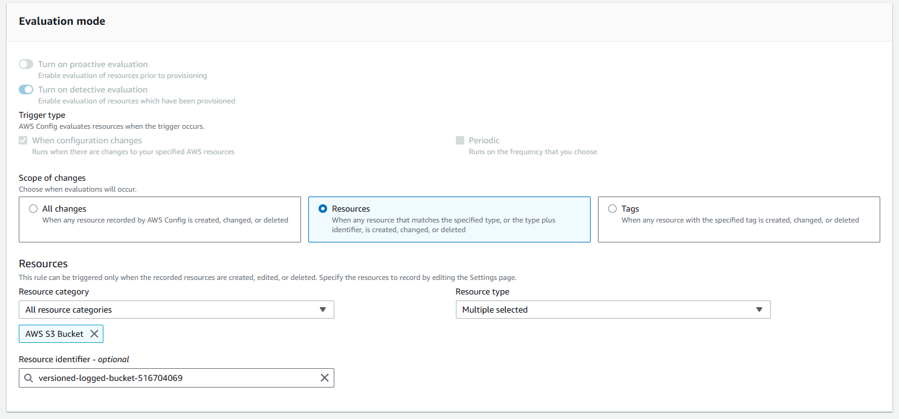

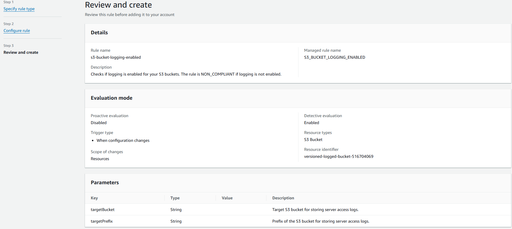

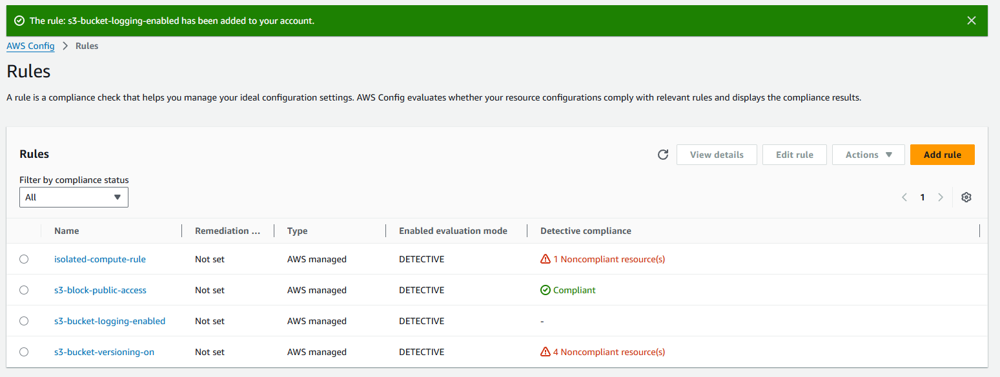

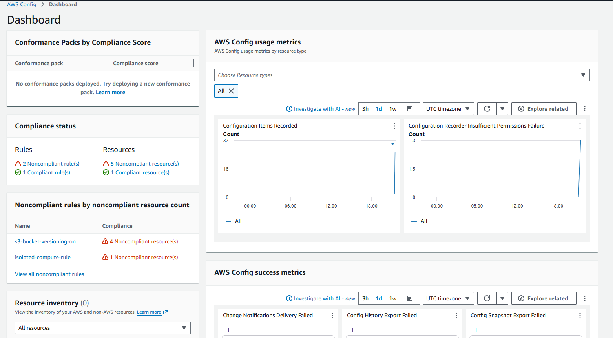

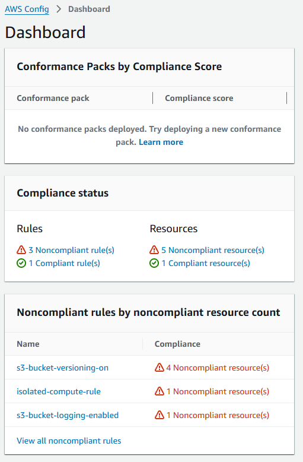

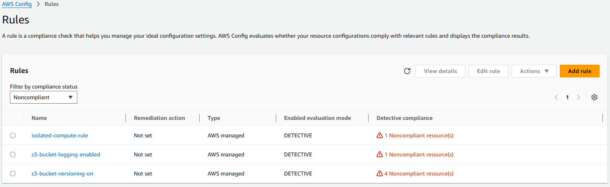

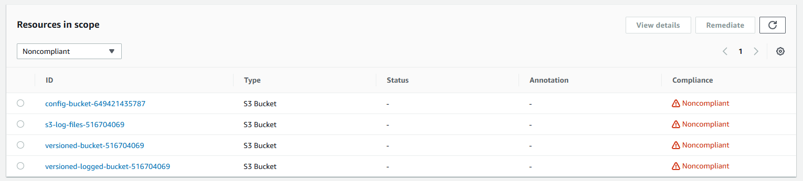

---

## Security Insights & Best Practices

- **Detective + corrective controls:** **Config rules** provide **continuous evaluation**; pairing them with **automated remediation** shortens **exposure window** for misconfigurations.
- **Scope deliberately:** target **high-risk** resource types (e.g., **public S3**, **open security groups**, **unencrypted volumes**) before broadening rule coverage.
- **Evidence for auditors:** **Config timeline** and **rule history** support **prove-it** conversations for **SOC**, **ISO**, and **PCI** style programs—when paired with **change management** and **least privilege** on who can edit rules and remediations.

---

## AWS Security Specialty Exam Relevance

**AWS Config** appears frequently across **governance**, **logging/monitoring**, and **data protection** domains on the **AWS Certified Security — Specialty** exam—especially **rule evaluation**, **remediation**, and **integration** with other services.

---

## Personal Reflections

**Config** is most valuable when treated as a **product**, not a checkbox: pick **fewer, sharper** rules, wire **remediation** with **safe defaults**, and review **false positives** as a team ritual. The lab’s screenshot trail is a good base for a **runbook** that names **which rule**, **which remediation document**, and **who approves** exceptions.
